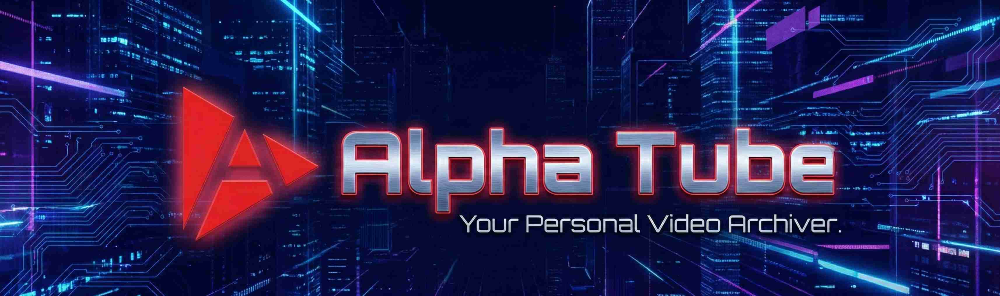

<!--
  Alpha Tube - Free Video Downloader for Windows
  Keywords: video downloader, youtube downloader, windows video downloader, 
  mp4 downloader, yt-dlp gui, free video downloader, download youtube videos,
  tauri app, desktop video downloader, windows 10, windows 11
-->

<p align="center">
  
</p>

<h1 align="center">🎬 Alpha Tube</h1>

<p align="center">
  <strong>Free, Fast Video Downloader for Windows 10/11</strong><br>
  <sub>Download videos from YouTube and 1000+ websites in HD quality. Open-source, lightweight, no ads.</sub>
</p>

<p align="center">
  <a href="https://github.com/sahasr-aksha/alpha-tube/releases"></a>
</p>

<p align="center">
  
  
  
  
  
</p>

<p align="center">
  
  
  
</p>

---

## 🚀 Why Alpha Tube?

| Feature | Description |
|---------|-------------|
| ⚡ **Super Fast** | Native Windows performance with Rust backend (Zoom zoom!) |
| 🎥 **Universal** | Works with YouTube, TikTok, Instagram & 1000+ sites |
| ✨ **HD Quality** | Crystal clear 4K, 1080p downloads |
| 🎵 **MP3 Support** | Extract music in high quality audio format |
| 🍿 **Built-in Player** | Watch your videos directly in the app |
| 🌙 **Modern Dark UI** | Sleek glassmorphism design that's easy on the eyes |
| 🔒 **Privacy First** | 100% offline processing - your data stays yours |
| 🎒 **Portable** | Lightweight & fast ~23MB installer |

---


## 📸 Screenshots

<p align="center">
  
  
</p>
<p align="center">
  
  
</p>
<p align="center">
  
  
</p>
<p align="center">
  
  
</p>
<p align="center">
  
</p>

---

## 🌸 Installation

### Option 1: Download Installer (Recommended)

1. Download the latest [Windows Installer (.exe)](https://github.com/sahasr-aksha/alpha-tube/releases/latest)
2. Run the installer and follow the setup wizard
3. Launch Alpha Tube from the Start Menu

### Option 2: Build from Source

#### Prerequisites

- [Node.js](https://nodejs.org/) v18 or higher
- [Rust](https://www.rust-lang.org/tools/install)
- Windows 10/11 with WebView2 (pre-installed on Windows 11)

#### Build Steps

```bash
# Clone the repository
git clone https://github.com/sahasr-aksha/alpha-tube.git
cd alpha-tube

# Install dependencies
npm install

# Run in development mode
npm run tauri dev

# Build for production
npm run tauri build
```

---

## 🛠️ Tech Stack

| Layer | Technology | Purpose |
|-------|------------|---------|
| **Frontend** | React 18, TypeScript, Vite | User Interface |
| **Backend** | Tauri 2.0, Rust | Native Performance |
| **Player** | Vidstack | Video Playback |
| **Downloader** | yt-dlp | Multi-platform Downloads |
| **Processor** | FFmpeg | Audio/Video Processing |
| **Styling** | CSS (Dark Glassmorphism) | Modern UI |

---

## ❓ FAQ

<details>
<summary><strong>Is Alpha Tube free?</strong></summary>

Yes! Alpha Tube is 100% free and open-source under the MIT license.
</details>

<details>
<summary><strong>Which websites are supported?</strong></summary>

Alpha Tube uses yt-dlp which supports 1000+ websites including YouTube, Vimeo, Twitter, Instagram, TikTok, Twitch, and many more. [See full list](https://github.com/yt-dlp/yt-dlp/blob/master/supportedsites.md).
</details>

<details>
<summary><strong>Is it safe to use?</strong></summary>

Alpha Tube is open-source, so you can inspect the code yourself. It processes everything locally on your PC - no data is sent to external servers.
</details>

<details>
<summary><strong>Does it work on Windows 7/8?</strong></summary>

Alpha Tube requires Windows 10 or Windows 11 with WebView2 runtime.
</details>

---

## 🚧 Known Issues

| Issue | Status |
|-------|--------|
| 🎧 **Dual Audio Tracks** | The built-in player currently cannot handle videos with dual audio tracks. **Fix in progress!** |

---

## ⚠️ Legal Disclaimer

> **Important**: Only download content you have the right to download. You are responsible for complying with the terms of service of any platform you use. See our [full disclaimer](DISCLAIMER.md).

---

## 📝 License

This project is licensed under the **MIT License** - see the [LICENSE](LICENSE) file for details.

### Third-Party Components

Alpha Tube includes the following open-source software:

- **[yt-dlp](https://github.com/yt-dlp/yt-dlp)** - Public Domain (Unlicense)
- **[FFmpeg](https://ffmpeg.org/)** - GPL v3
- **[Vidstack](https://vidstack.io/)** - MIT

See [THIRD_PARTY_LICENSES.md](THIRD_PARTY_LICENSES.md) for complete details.

---

<p align="center">
  <sub>Made with ❤️ by <a href="https://github.com/sahasr-aksha">Aryan Singh</a></sub>
</p>

<p align="center">
  <sub>
    <strong>Keywords:</strong> video downloader windows, youtube downloader, mp4 downloader, 
    free video downloader, yt-dlp gui, download youtube videos, tauri app, 
    windows video downloader, open source video downloader
  </sub>
</p>
